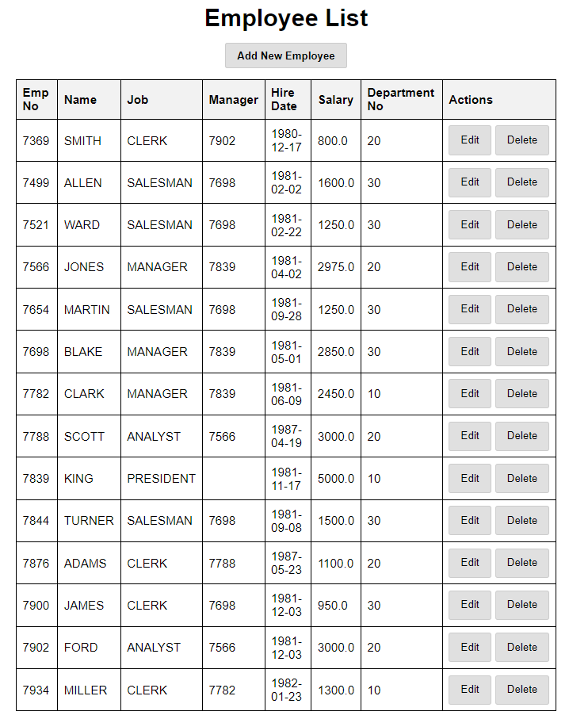

# MVC 패턴 연습 프로젝트

## URL 접근 방법

### 1. **직원 목록 페이지**
- **URL**: `http://localhost:8080/emps`
- 직원 목록을 조회하는 페이지입니다.
  


---

### 2. **부서 목록 페이지**
- **URL**: `http://localhost:8080/deps`
- 부서 목록을 조회하는 페이지입니다.


---

### 3. **직원 추가 페이지**
- **URL**: `http://localhost:8080/emps/{emptno}`
- 직원 정보를 추가할 수 있는 페이지입니다.


---

### 4. **부서 추가 페이지**
- **URL**: `http://localhost:8080/deps/{deptno}`
- 부서 정보를 추가할 수 있는 페이지입니다.


---

### 5. **직원 수정 페이지**
- **URL**: `http://localhost:8080/emps/edit/{emptno}`
- 직원의 정보를 수정할 수 있는 페이지입니다.


---

### 5. **부서 수정 페이지**
- **URL**: `http://localhost:8080/emps/edit/{deptno}`
- 부서의 정보를 수정할 수 있는 페이지입니다.


---

## 프로젝트 설정

- **Project**: Maven Project
- **Language**: Java
- **Framework**: Spring Boot

---

## Dependencies

- **Spring Web**: 웹 애플리케이션을 위한 기본적인 기능 제공
- **Spring Data JPA**: 데이터베이스와의 상호작용을 위한 JPA
- **PostgreSQL Driver**: PostgreSQL 데이터베이스 연결을 위한 드라이버
- **Thymeleaf**: 서버사이드 렌더링을 위한 뷰 템플릿 엔진

---

## API 요청 테스트

- **Postman**: API 요청을 테스트할 때 사용

---

## 프로젝트 구조

```
src
└── main
├── java
│ └── com.example.mvc_pattern_practice
│ ├── controller <-- 요청을 처리하는 컨트롤러
│ ├── service <-- 비즈니스 로직
│ ├── repository <-- 데이터베이스와의 상호작용
│ ├── model <-- 데이터베이스 엔티티 (Dept, Emp 등)
│ └── MvcPatternPracticeApplication.java <-- 메인 애플리케이션 실행 파일
└── resources
├── static <-- 정적 파일 (CSS, JS 등)
├── templates <-- HTML 템플릿 (Thymeleaf 등)
└── application.yml <-- 설정 파일
```

---

## 주요 기능

- **Employee List**: 직원 정보를 조회, 추가, 수정 및 삭제 기능을 제공
- **Department List**: 부서 정보를 조회 및 추가 기능을 제공
- **Thymeleaf 템플릿 엔진**을 사용하여 HTML 뷰 렌더링
- **PostgreSQL**을 데이터베이스로 사용하여 직원 및 부서 정보를 저장

---

## MVC 패턴 구현

### 1. **Service Bean 등록 (@Service)**
- 서비스 계층의 클래스를 Spring Bean으로 등록하여 Spring 컨테이너가 관리하도록 합니다.
- 서비스 계층은 비즈니스 로직을 처리하는 클래스로, 이를 Spring Bean으로 등록하여 Spring이 관리하도록 설정합니다.

---

### 2. **Controller Bean 등록 (@Controller)**
- **Controller**는 MVC 패턴에서 사용자 요청을 처리하는 역할을 담당합니다. 사용자가 요청한 URL에 맞는 메소드를 매핑하고, 적절한 응답을 반환합니다.
- 각 요청에 맞는 컨트롤러 클래스를 작성하여 `@Controller` 어노테이션을 통해 Spring 컨테이너에 등록합니다.

---

### 3. **의존성 주입 (@Autowired)**
- **@Autowired** 어노테이션을 사용하여 Spring이 자동으로 객체를 주입합니다. 주로 서비스 계층(@Service)이나 컨트롤러(@Controller) 클래스에서 다른 Bean을 주입받을 때 사용됩니다.

---

## @DeleteMapping 대신 @PostMapping을 사용한 이유

### 1. **HTML 폼의 제한**
- `<form>` 태그는 기본적으로 `GET`과 `POST`만 지원하여, `DELETE` 메서드를 사용할 수 없음.
- 삭제 요청을 `POST` 방식으로 처리해야 함.

### 2. **RESTful API 설계의 유연성**
- `POST`는 리소스를 삭제하는 데에도 사용할 수 있음.
- 삭제 작업을 `POST`로 처리해도 RESTful 원칙에 맞음.

### 3. **보안 강화 및 CSRF 방지**
- `POST`는 CSRF 토큰을 쉽게 적용할 수 있어 보안 강화에 유리.
- `DELETE`는 CSRF 방어가 어려운 경우가 많음.

### 4. **URL 의존성 감소**
- `DELETE`는 URL에 리소스를 명시해야 하지만, `POST`는 본문에 데이터를 포함하여 URL을 깔끔하게 유지할 수 있음.

### **결론**
- `POST`는 삭제 작업을 처리할 수 있으며, 보안과 실용성 측면에서 유리.

---

## 추가 기능 및 설명

- **EmployeeController**: 직원 목록을 관리하는 컨트롤러로, 직원 정보를 조회하고 이를 뷰로 전달합니다.
- **EmployeeService**: 서비스 계층으로, 직원 관련 비즈니스 로직을 처리하고 데이터베이스와 상호작용합니다.
- **EmployeeRepository**: Spring Data JPA를 활용한 데이터베이스 조회를 위한 리포지토리 인터페이스
- **Thymeleaf**를 사용하여 **HTML 템플릿**을 렌더링하며, 컨트롤러에서 반환한 데이터를 뷰로 전달합니다.

---

## 실행 방법

1. **PostgreSQL 데이터베이스 설정**: `application.yml` 파일에 PostgreSQL 연결 설정을 추가합니다.
2. **Maven 빌드**: `mvn clean install` 명령어로 프로젝트를 빌드합니다.
3. **애플리케이션 실행**: `mvn spring-boot:run` 명령어로 애플리케이션을 실행합니다.

---

## 결론

이 프로젝트는 **Spring Boot**와 **Thymeleaf**를 사용하여 **MVC 패턴**을 구현한 예제입니다. 데이터베이스와의 연동, 사용자 인터페이스 제공, 그리고 비즈니스 로직 처리까지 전반적인 애플리케이션 개발의 흐름을 연습할 수 있습니다.
